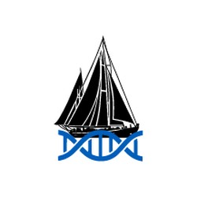

.. CS-Sea-CATG documentation master file, created by
   sphinx-quickstart on Tue Jul 27 14:48:17 2021.
   You can adapt this file completely to your liking, but it should at least
   contain the root `toctree` directive.

Welcome to WHOI, and to the Alexander Lab!
=======================================

Follow the links below to start to dive into some of the topics covered on this site.

.. toctree::
   :maxdepth: 2
   :caption: Contents:
   
   intro-lab.md
   getting-started-poseidon.md
   using-snakemake.md
   

WHOI-related links
------------------

 - `Managing and Monitoring Jobs on Poseidon
<https://whoi-it.whoi.edu/managing-and-monitoring-jobs-on-poseidon/>`_.
 
